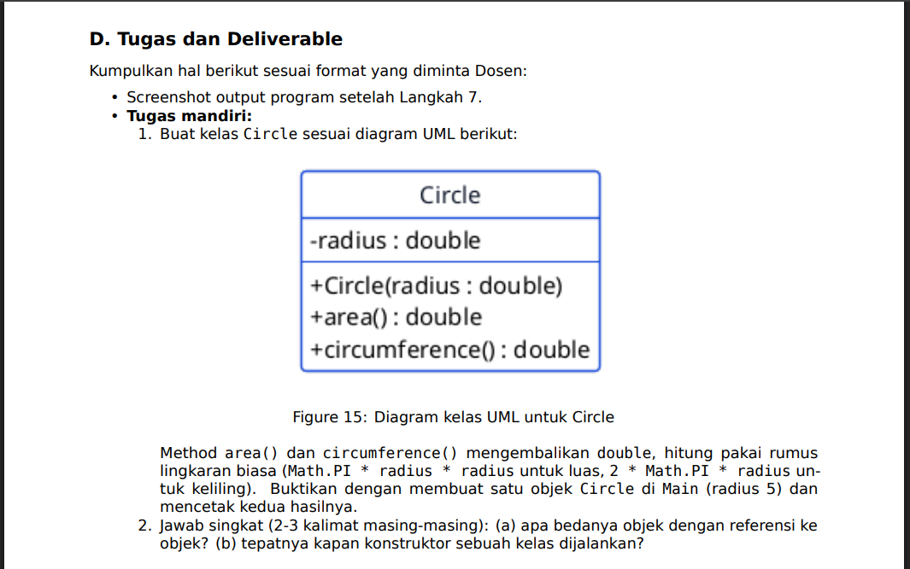

# laporan Praktikum Pemograman Berbasis Objek 2

<h4>Nama    : Reyhandhika Zikri Prijadi<h4>
<h4>Nim     : 254107020219<h4>
<h4>Kelas   : TI-2G<h4>

## Code Rectangle.java
```bash
package jobsheet2.id.ac.polinema;

public class Rectangle {
    int width;
    int height;

    Rectangle(int width, int height){
        this.width = width;
        this.height = height;
    }
    
    int area(){
        return  width * height;
    }
    int perimeter(){
        return  2* (width + height);
    }
}

```

## Code Main.java

```bash
package jobsheet2.id.ac.polinema;

public class Main {
    public static void main(String[] args) {
        // Rectangle original = new Rectangle(6,4);
        // r.width = 6;
        // r.height = 4;

        // System.out.println("Rectangle " + r.width + "x" + r.height);

        // System.out.println("Area: " + r.area());
        // System.out.println("Perimeter: " + r.perimeter());

        // System.out.println("Area: " + original.area());
        // Rectangle copy = original;
        // copy.width = 10;
        // System.out.println("Via original: " + original.area());
        // System.out.println("Via copy: " + copy.area());

        Rectangle[] shapes = new Rectangle[3];
        shapes[0] = new Rectangle(6, 4);
        shapes[1] = new Rectangle(3, 3);
        shapes[2] = new Rectangle(8, 2);

        for (Rectangle r : shapes){
            System.out.println("Area: " + r.area() + ", Perimeter: " + r.perimeter());
        }

       Student s = new Student("Raya", "S001", 3.8);
       System.out.println(s.describe());

    }
}

```
## Code Student.java
```bash
package jobsheet2.id.ac.polinema;

public class Student {
    private String name;
    private  String studentId;
    private  double gpa;

    Student(String name, String studentId, double gpa) {
        this.name = name;
        this.studentId = studentId;
        this.gpa = gpa;
    }
    public  String describe(){
        return name + " (" + studentId + ", GPA: " + gpa + ")";
     
    }
}

```

### Hasil


## Latihan 


## Code Circle25.java
```bash
package jobsheet2.id.ac.polinema;

public class Circle25 {
    double radius;
    Circle25(double radius){
        this.radius = radius;
    }

    double area(){
        return Math.PI * radius * radius;
    }
    double circumference(){
        return 2 * Math.PI *radius *radius;
    }
    
}

```

### (a) Apa bedanya objek dengan referensi ke objek?
```bash
Objek adalah instance nyata dari sebuah kelas yang memiliki data dan perilaku. Sedangkan referensi ke objek adalah variabel yang menyimpan alamat atau menunjuk ke lokasi objek tersebut di memori.
```
### (b) Tepatnya kapan konstruktor sebuah kelas dijalankan?
```bash
Konstruktor dijalankan secara otomatis ketika sebuah objek baru dibuat menggunakan keyword new. Konstruktor digunakan untuk menginisialisasi nilai awal atribut atau keadaan objek.
```